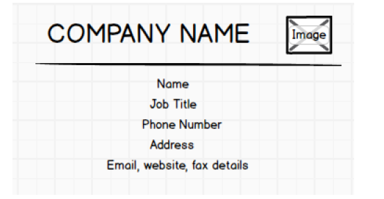
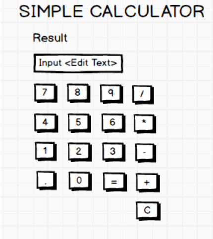

# Mobile application development (18CSMP68)

1. Create an application to design aVisiting Card. The Visiting card should havea companylogoatthe
   top right corner. The company name should be displayed in Capital letters, aligned to the center.
   Information like the name of the employee, job title, phone number, address, email, fax and the
   website address is to be displayed. Insert a horizontal line between the job title and the phone
   number.
   

2. Develop an Android application usingcontrols like Button, TextView, EditText for designing a
   calculatorhaving basic functionality like Addition, Subtraction, Multiplication,andDivision.
   
