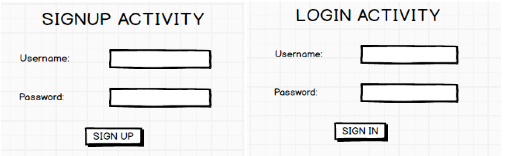

# Mobile application development (18CSMP68)

1. Create an application to design aVisiting Card. The Visiting card should havea companylogoatthe
   top right corner. The company name should be displayed in Capital letters, aligned to the center.
   Information like the name of the employee, job title, phone number, address, email, fax and the
   website address is to be displayed. Insert a horizontal line between the job title and the phone
   number.
   

2. Develop an Android application usingcontrols like Button, TextView, EditText for designing a
   calculatorhaving basic functionality like Addition, Subtraction, Multiplication,andDivision.
   

3. Create a SIGN Up activity with Username and Password. Validation of password should happen
   based on the following rules:
   • Password should contain uppercase and lowercase letters.
   • Password should contain letters and numbers.
   • Password should contain special characters.
   • Minimum length of the password (the default value is 8).
   On successful SIGN UP proceed to the next Login activity. Here the user should SIGN IN using
   the Username and Password created during signup activity. If the Username and Password are
   matched then navigate to the next activity whichdisplays a message saying “Successful Login” or
   else display a toast message saying “Login Failed”.The user is given only two attempts and after
   thatdisplay a toast message saying “Failed Login Attempts” and disable the SIGN IN button. Use
   Bundle to transfer information from one activity to another.
   
